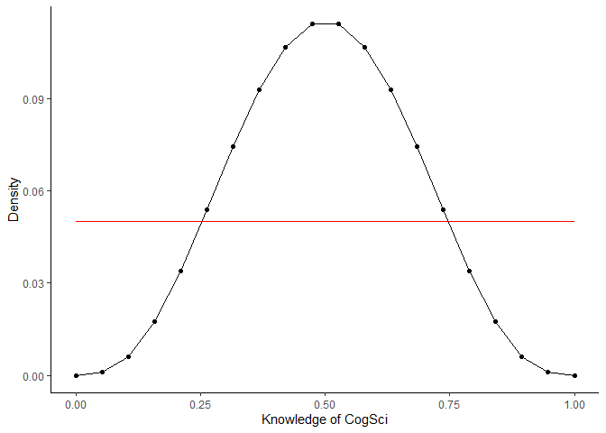
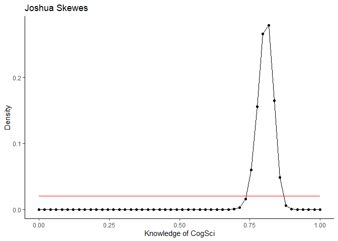
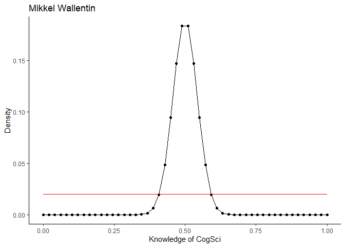
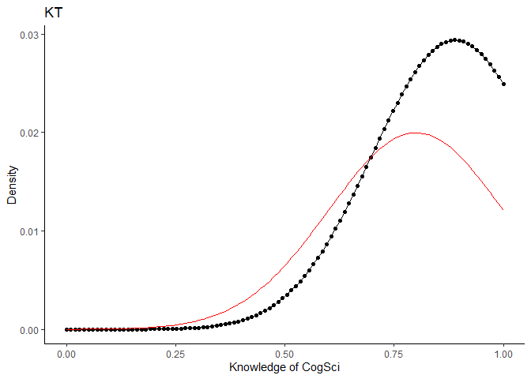
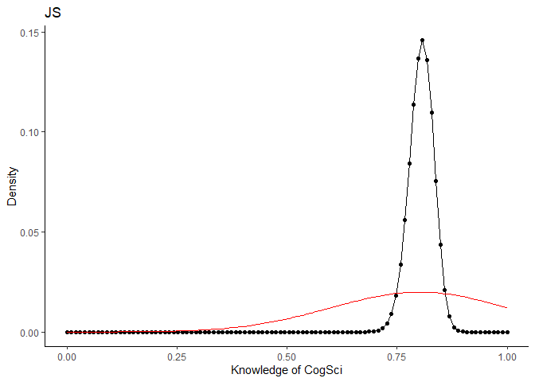
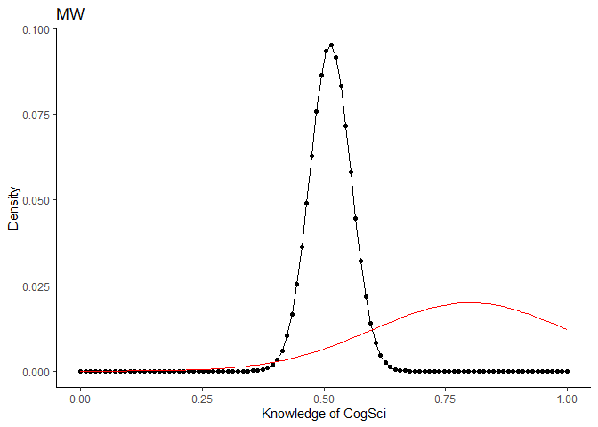
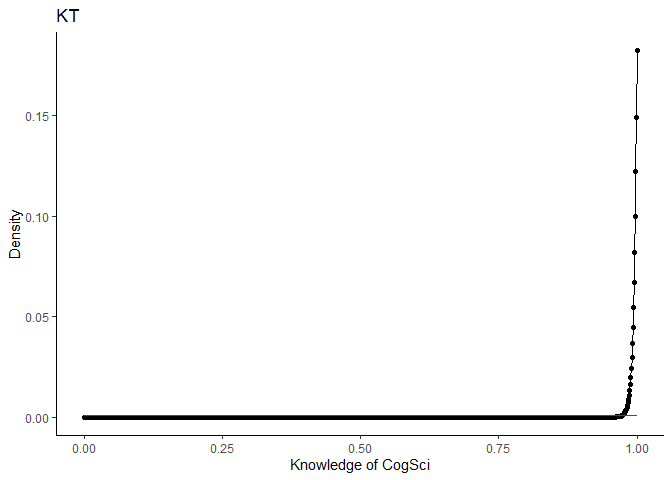
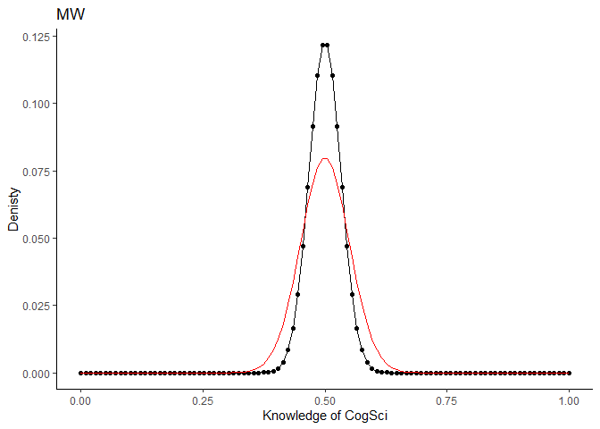
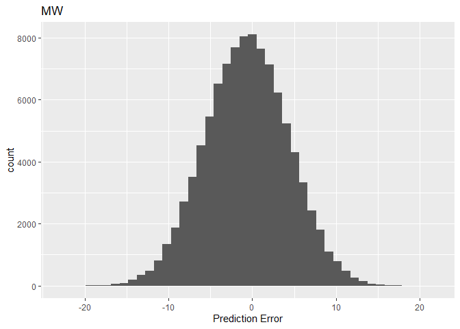

In this assignment we learn how to assess rates from a binomial distribution, using the case of assessing your teachers' knowledge of CogSci
--------------------------------------------------------------------------------------------------------------------------------------------

N.B. there is a second part at the bottom for next week.

### First part

You want to assess your teachers' knowledge of cognitive science. "These guys are a bunch of drama(turgist) queens, mindless philosophers, chattering communication people and Russian spies. Do they really know CogSci?", you think.

To keep things simple (your teachers should not be faced with too complicated things): - You created a pool of equally challenging questions on CogSci - Each question can be answered correctly or not (we don't allow partially correct answers, to make our life simpler). - Knowledge of CogSci can be measured on a scale from 0 (negative knowledge, all answers wrong) through 0.5 (random chance) to 1 (awesome CogSci superpowers)

This is the data: - Riccardo: 3 correct answers out of 6 questions - Kristian: 2 correct answers out of 2 questions (then he gets bored) - Josh: 160 correct answers out of 198 questions (Josh never gets bored) - Mikkel: 66 correct answers out of 132 questions

``` r
#Data
data <- data.frame(
  correct=c(3,2,160,66),
  questions=c(6,2,198,132),
  teacher=c("RF","KT","JS","MW"))
```

Questions:

1.  What's Riccardo's estimated knowledge of CogSci? What is the probability he knows more than chance (0.5) \[try figuring this out. if you can't peek into chapters 3.1 and 3.2 and/or the slides\]?

-   First implement a grid approximation (hint check paragraph 2.4.1!) with a uniform prior, calculate the posterior and plot the results
-   Then implement a quadratic approximation (hint check paragraph 2.4.2!).
-   N.B. for the rest of the exercise just keep using the grid approximation (we'll move to quadratic approximations in two classes)

``` r
# Grid approximation 
#Define grid
dens <- 20 #interval
prob_grid <- seq(from = 0 , to = 1 , length.out = dens)

#Define prior
prior <- rep( 1 , dens ) # Flat

#Test the prior (does it look crazy?)
dens(rbinom(1e4, 6, runif(1e4, 0, 1)))
```


``` r
# simulating answering 6 questions 10.000 times with a flat (uniform) prior (it is equally likely to get 0 and 1)
# All outcomes are equally possible

#Compute the likelihood at each value in grid
likelihood <- dbinom( 3 , size = 6 , prob = prob_grid )

likelihood
```

    ##  [1] 0.000000000 0.002479282 0.016708795 0.047014530 0.091825255 0.145815103
    ##  [7] 0.201740084 0.251968499 0.289705277 0.309910234 0.309910234 0.289705277
    ## [13] 0.251968499 0.201740084 0.145815103 0.091825255 0.047014530 0.016708795
    ## [19] 0.002479282 0.000000000

``` r
#Compute the posterior (likelihood by prior)
unstd.posterior <- likelihood * prior

#Standardize the posterior (so it sums to 1)
posterior <- unstd.posterior / sum(unstd.posterior)

#What is RF's knowledge of CogSci
match(max(posterior), posterior) / length(posterior)
```

    ## [1] 0.5

``` r
# Max is at 50% 

# add up posterior probability where p > 0.5 
sum( posterior[ prob_grid > 0.5 ] )
```

    ## [1] 0.5

``` r
#Draw the plot
d <- data.frame(grid = prob_grid, posterior = posterior, prior = prior, likelihood = likelihood)
ggplot(d, aes(grid,posterior)) +  geom_point() +geom_line()+theme_classic()+  geom_line(aes(grid, prior/dens),color= 'red')+  xlab('Knowledge of CogSci')+ ylab('Density')
```



``` r
# quadratic approximation
rf_qa <- rethinking::map(alist(
  a ~ dbinom(6,p), # binomial likelihood   
  p ~ dunif(0,1) # uniform prior
  ),
  data=list(a=3)) 

#Display summary
precis(rf_qa)
```

    ##   Mean StdDev 5.5% 94.5%
    ## p  0.5    0.2 0.17  0.83

``` r
# Quadratic approxiamation assumes that the posterior is a gaussian distribution - in this case with a mean of 0.5 and SD of 0.2
```

1.  Estimate all the teachers' knowledge of CogSci. Who's best? Use grid approximation. Comment on the posteriors of Riccardo and Mikkel. 2a. Produce plots of the prior, and posterior for each teacher.

Making a function to return prior, likelihood and posterior

``` r
# Making a function that can return our output
 calc_teacher <- function(teacher, correct, questions, prior, prob_grid){
   
   # Compute likelihood 
   likelihood <- dbinom( correct, size = questions, prob = prob_grid )
   
   # Compute unstandardized posterior from likelihood and the prior
   uns_posterior <- likelihood * prior
   
   # Compute standardized posterior. 
   posterior <- uns_posterior / sum(uns_posterior)
   
   # Compute MAP (Maximum a posterior)
   map <- match(max(posterior),posterior) / length(posterior)
   
   # posterior probability where p > 0.5
   chance <- sum(posterior[ prob_grid > 0.5 ])
   
   # Teacher as factor
   teacher <- as.factor(teacher)
  
   # specify output
   return(list(teacher, map, chance, prior, likelihood, posterior))
   
 }

#Loop through all teachers

# Making empty dataframe
teacher_info <- data.frame(teacher = factor(), MAP = numeric(), chance = numeric(), prior = numeric(), likelihood = numeric(), posterior = numeric())
# Run loop to extract MAP and 'chance above chance' for each teacher
for(i in 1:nrow(data)) {
    
    correct <- data[i,1]
    questions <- data[i,2]
    teacher <- data[i,3]
    # Define grid and prior
    prob_grid <- seq(from = 0, to = 1, length.out = 10000)
    prior <- rep(1, 10000)
    
    
    # Use my sexy little function
    info <- calc_teacher(teacher, correct, questions, prior, prob_grid) %>% as.data.frame()
    
    names(info)[1] <- "teacher"
    names(info)[2] <- "MAP"
    names(info)[3] <- "chance"
    names(info)[4] <- "prior"
    names(info)[5] <- "likelihood"
    names(info)[6] <- "posterior"
    
    # Combine with premade empty dataframe
    if (nrow(teacher_info) == 0) {
      teacher_info <- info}
      else {
        teacher_info <- rbind(teacher_info, info)}
    
}

#Prob grid
prob_grid <- seq(from = 0, to = 1, length.out = 10000)

#Posterior for each teacher
JS_pos <- teacher_info$posterior[teacher_info$teacher == 'JS']
KT_pos <- teacher_info$posterior[teacher_info$teacher == 'KT']
MW_pos <- teacher_info$posterior[teacher_info$teacher == 'MW']
RF_pos <- teacher_info$posterior[teacher_info$teacher == 'RF']

#Sample from all
sam_JS <- sample(size = 10000, x = prob_grid, prob = JS_pos, replace = T)
sam_KT <- sample(size = 10000, x = prob_grid, prob = KT_pos, replace = T)
sam_MW <- sample(size = 10000, x = prob_grid, prob = MW_pos, replace = T)
sam_RF <- sample(size = 10000, x = prob_grid, prob = RF_pos, replace = T)

#Difference between teachers
# JS and KT
sum(sam_JS > sam_KT)/10000*100
```

    ## [1] 52.75

``` r
# RF and MW
sum(sam_RF > sam_MW)/10000*100
```

    ## [1] 50.25

Function for plots

``` r
g_approx2 <- function(correct, questions, teacher, dens){
  #Define grid
  prob_grid <- seq(from = 0 , to = 1 , length.out = dens)
  
  #Define prior
  prior <- rep(1, dens) #Flat
  
  #Likelihood
  likelihood <- dbinom(correct, size = questions, prob = prob_grid)
  
  #posterior
  unstd.posterior <- likelihood * prior
  posterior <- unstd.posterior / sum(unstd.posterior)
  
  #What is teacher's knowledge of CogSci
  teacher <- as.character(teacher)
  s <- c(match(max(posterior), posterior) / length(posterior), sum( posterior[ prob_grid > 0.5 ] ), teacher)
  print(s)
  
  #Plot
  d <- data.frame(grid = prob_grid, posterior = posterior, prior = prior, likelihood = likelihood)
  ggplot(d, aes(grid,posterior)) +
          geom_point() +geom_line()+theme_classic() +
          geom_line(aes(grid, prior/dens),color= 'red')+
          ggtitle(teacher) +
          xlab("Knowledge of CogSci")+ ylab("Density")
  
}

#Applying manually for all teachers
g_approx2(3, 6, "Riccardo Fusaroli", 20)
```

    ## [1] "0.5"               "0.5"               "Riccardo Fusaroli"


``` r
g_approx2(2,2, "Kristian Tylén", 20)
```

    ## [1] "1"                 "0.884615384615385" "Kristian Tylén"


``` r
g_approx2(160,198, "Joshua Skewes", 50)
```

    ## [1] "0.82"          "1"             "Joshua Skewes"



``` r
g_approx2(66,132, "Mikkel Wallentin", 50)
```

    ## [1] "0.5"              "0.5"              "Mikkel Wallentin"



``` r
#Doing it for all data
for (i in 1:nrow(data)){
  print(g_approx2(data$correct[i], data$questions[i], data$teacher[i], dens = 10000))
  
}
```

    ## [1] "0.5" "0.5" "RF"


    ## [1] "1"                 "0.875018750937547" "KT"


    ## [1] "0.8081" "1"      "JS"


    ## [1] "0.5" "0.5" "MW"


1.  Change the prior. Given your teachers have all CogSci jobs, you should start with a higher appreciation of their knowledge: the prior is a normal distribution with a mean of 0.8 and a standard deviation of 0.2. Do the results change (and if so how)? 3a. Produce plots of the prior and posterior for each teacher.

``` r
#changing prior in function
g_approx3 <- function(data, dens){
  #Loop through data
  for(i in 1:nrow(data))
    {
    #Define variables
    correct <- data[i,1] 
    questions <- data[i,2]
    teacher <- data[i,3]
    
  prob_grid <- seq(from = 0 , to = 1 , length.out = dens) #Grid with dens specified in function
  
  #Define prior
  prior <- dnorm(prob_grid, 0.8, 0.2) # normal distribution with mean 0.8 and SD 0.2
  
  #Likelihood
  likelihood <- dbinom(correct, size = questions, prob = prob_grid)
  
  #Posterior
  unstd.posterior <- likelihood * prior
  posterior <- unstd.posterior / sum(unstd.posterior)
  
  #Plot
  d <- data.frame(grid = prob_grid, posterior = posterior, prior = prior, likelihood = likelihood)
  print(ggplot(d, aes(grid,posterior)) +
          geom_point() +geom_line()+theme_classic() +
          geom_line(aes(grid, prior/dens),color= 'red')+
          ggtitle(teacher) +
          xlab("Knowledge of CogSci")+ ylab("Density"))
  
  #Performance
  teacher <- as.character(teacher)
  s <- c((match(max(posterior),posterior)/length(posterior)),sum(posterior[prob_grid > 0.5 ] ),teacher)
  print(s)
  
}}

g_approx3(data,dens = 100)
```


    ## [1] "0.65"              "0.841833150977187" "RF"



    ## [1] "0.89"              "0.976080923475512" "KT"



    ## [1] "0.81" "1"    "JS"



    ## [1] "0.52"             "0.62434566100276" "MW"

1.  You go back to your teachers and collect more data (multiply the previous numbers by 100). Calculate their knowledge with both a uniform prior and a normal prior with a mean of 0.8 and a standard deviation of 0.2. Do you still see a difference between the results? Why?

``` r
#New data
dataBIG <- data %>% 
  mutate(
    correct = (correct * 100),
    questions = (questions * 100),
    teacher = teacher
  ) 

#grid approximation with uniform prior
for (i in 1:nrow(dataBIG)){
  print(g_approx2(dataBIG$correct[i], dataBIG$questions[i], dataBIG$teacher[i], dens = 1000))
  
}
```

    ## [1] "0.5" "0.5" "RF"


    ## [1] "1"  "1"  "KT"



    ## [1] "0.808" "1"     "JS"


    ## [1] "0.5" "0.5" "MW"


``` r
# with gaussian prior
g_approx3(dataBIG,1000)
```


    ## [1] "0.504"             "0.560408921107491" "RF"


    ## [1] "1"  "1"  "KT"


    ## [1] "0.808" "1"     "JS"


    ## [1] "0.501"            "0.51304350921187" "MW"

1.  Imagine you're a skeptic and think your teachers do not know anything about CogSci, given the content of their classes. How would you operationalize that belief?

``` r
#changing prior in function
g_approx5 <- function(data, dens){
  #Loop through data
  for(i in 1:nrow(data))
    {
    #Define variables
    correct <- data[i,1] 
    questions <- data[i,2]
    teacher <- data[i,3]
    
  prob_grid <- seq(from = 0 , to = 1 , length.out = dens) #Grid with dens specified in function
  
  #Define prior
  prior <- dnorm(prob_grid, 0.5, 0.05) # normal distribution with mean 0.5 (change) and SD 0.05
  
  #Likelihood
  likelihood <- dbinom(correct, size = questions, prob = prob_grid)
  
  #Posterior
  unstd.posterior <- likelihood * prior
  posterior <- unstd.posterior / sum(unstd.posterior)
  
  #Plot
  d <- data.frame(grid = prob_grid, posterior = posterior, prior = prior, likelihood = likelihood)
  print(ggplot(d, aes(grid,posterior)) +
          geom_point() +geom_line()+theme_classic() +
          geom_line(aes(grid, prior/dens),color= 'red')+
          ggtitle(teacher) +
          xlab("Knowledge of CogSci")+ ylab("Denisty"))
  
  #Performance
  teacher <- as.character(teacher)
  s <- c((match(max(posterior),posterior)/length(posterior)),sum(posterior[prob_grid > 0.5 ] ),teacher)
  print(s)
}}

g_approx5(data,100)
```


    ## [1] "0.5" "0.5" "RF"


    ## [1] "0.51"             "0.57913329112768" "KT"


    ## [1] "0.72"              "0.999999999999882" "JS"



    ## [1] "0.5" "0.5" "MW"

1.  Optional question: Can you estimate the difference between Riccardo's estimated knowledge and that of each of the other teachers? Would you deem it credible (that is, would you believe that it is actually different)?

-   You could subtract peak for the posterior distribution of each teacher. However, this would not be a credible measure. It would be better to look at intervals of the same probability, as some would have larger intervals (indicating a smaller certainty) and other would have smaller (HDPI or PI).

1.  Bonus knowledge: all the stuff we have done can be implemented in a lme4-like fashion using the brms package. Here is an example.

``` r
p_load(brms)

d <- data.frame(
  Correct=c(3,2,160,66),
  Questions=c(6,2,198,132),
  Teacher=c("RF","KT","JS","MW"))

# Model sampling only from the prior (for checking the predictions your prior leads to)
FlatModel_priorCheck <- brm(Correct|trials(Questions) ~ 1,
                 data = subset(d, Teacher=="RF"),
                 prior = prior("uniform(0,1)", class = "Intercept"),
                 family = binomial,
                 sample_prior = "only") # here we tell the model to ignore the data
```

    ## Compiling the C++ model

    ## Start sampling

    ## 
    ## SAMPLING FOR MODEL '48518db43043de5ed9671e5906dc3bd6' NOW (CHAIN 1).
    ## Chain 1: Rejecting initial value:
    ## Chain 1:   Log probability evaluates to log(0), i.e. negative infinity.
    ## Chain 1:   Stan can't start sampling from this initial value.
    ## Chain 1: Rejecting initial value:
    ## Chain 1:   Log probability evaluates to log(0), i.e. negative infinity.
    ## Chain 1:   Stan can't start sampling from this initial value.
    ## Chain 1: Rejecting initial value:
    ## Chain 1:   Log probability evaluates to log(0), i.e. negative infinity.
    ## Chain 1:   Stan can't start sampling from this initial value.
    ## Chain 1: Rejecting initial value:
    ## Chain 1:   Log probability evaluates to log(0), i.e. negative infinity.
    ## Chain 1:   Stan can't start sampling from this initial value.
    ## Chain 1: 
    ## Chain 1: Gradient evaluation took 0 seconds
    ## Chain 1: 1000 transitions using 10 leapfrog steps per transition would take 0 seconds.
    ## Chain 1: Adjust your expectations accordingly!
    ## Chain 1: 
    ## Chain 1: 
    ## Chain 1: Iteration:    1 / 2000 [  0%]  (Warmup)
    ## Chain 1: Iteration:  200 / 2000 [ 10%]  (Warmup)
    ## Chain 1: Iteration:  400 / 2000 [ 20%]  (Warmup)
    ## Chain 1: Iteration:  600 / 2000 [ 30%]  (Warmup)
    ## Chain 1: Iteration:  800 / 2000 [ 40%]  (Warmup)
    ## Chain 1: Iteration: 1000 / 2000 [ 50%]  (Warmup)
    ## Chain 1: Iteration: 1001 / 2000 [ 50%]  (Sampling)
    ## Chain 1: Iteration: 1200 / 2000 [ 60%]  (Sampling)
    ## Chain 1: Iteration: 1400 / 2000 [ 70%]  (Sampling)
    ## Chain 1: Iteration: 1600 / 2000 [ 80%]  (Sampling)
    ## Chain 1: Iteration: 1800 / 2000 [ 90%]  (Sampling)
    ## Chain 1: Iteration: 2000 / 2000 [100%]  (Sampling)
    ## Chain 1: 
    ## Chain 1:  Elapsed Time: 0.228 seconds (Warm-up)
    ## Chain 1:                0.256 seconds (Sampling)
    ## Chain 1:                0.484 seconds (Total)
    ## Chain 1: 
    ## 
    ## SAMPLING FOR MODEL '48518db43043de5ed9671e5906dc3bd6' NOW (CHAIN 2).
    ## Chain 2: Rejecting initial value:
    ## Chain 2:   Log probability evaluates to log(0), i.e. negative infinity.
    ## Chain 2:   Stan can't start sampling from this initial value.
    ## Chain 2: Rejecting initial value:
    ## Chain 2:   Log probability evaluates to log(0), i.e. negative infinity.
    ## Chain 2:   Stan can't start sampling from this initial value.
    ## Chain 2: Rejecting initial value:
    ## Chain 2:   Log probability evaluates to log(0), i.e. negative infinity.
    ## Chain 2:   Stan can't start sampling from this initial value.
    ## Chain 2: Rejecting initial value:
    ## Chain 2:   Log probability evaluates to log(0), i.e. negative infinity.
    ## Chain 2:   Stan can't start sampling from this initial value.
    ## Chain 2: Rejecting initial value:
    ## Chain 2:   Log probability evaluates to log(0), i.e. negative infinity.
    ## Chain 2:   Stan can't start sampling from this initial value.
    ## Chain 2: 
    ## Chain 2: Gradient evaluation took 0 seconds
    ## Chain 2: 1000 transitions using 10 leapfrog steps per transition would take 0 seconds.
    ## Chain 2: Adjust your expectations accordingly!
    ## Chain 2: 
    ## Chain 2: 
    ## Chain 2: Iteration:    1 / 2000 [  0%]  (Warmup)
    ## Chain 2: Iteration:  200 / 2000 [ 10%]  (Warmup)
    ## Chain 2: Iteration:  400 / 2000 [ 20%]  (Warmup)
    ## Chain 2: Iteration:  600 / 2000 [ 30%]  (Warmup)
    ## Chain 2: Iteration:  800 / 2000 [ 40%]  (Warmup)
    ## Chain 2: Iteration: 1000 / 2000 [ 50%]  (Warmup)
    ## Chain 2: Iteration: 1001 / 2000 [ 50%]  (Sampling)
    ## Chain 2: Iteration: 1200 / 2000 [ 60%]  (Sampling)
    ## Chain 2: Iteration: 1400 / 2000 [ 70%]  (Sampling)
    ## Chain 2: Iteration: 1600 / 2000 [ 80%]  (Sampling)
    ## Chain 2: Iteration: 1800 / 2000 [ 90%]  (Sampling)
    ## Chain 2: Iteration: 2000 / 2000 [100%]  (Sampling)
    ## Chain 2: 
    ## Chain 2:  Elapsed Time: 0.224 seconds (Warm-up)
    ## Chain 2:                0.221 seconds (Sampling)
    ## Chain 2:                0.445 seconds (Total)
    ## Chain 2: 
    ## 
    ## SAMPLING FOR MODEL '48518db43043de5ed9671e5906dc3bd6' NOW (CHAIN 3).
    ## Chain 3: Rejecting initial value:
    ## Chain 3:   Log probability evaluates to log(0), i.e. negative infinity.
    ## Chain 3:   Stan can't start sampling from this initial value.
    ## Chain 3: Rejecting initial value:
    ## Chain 3:   Log probability evaluates to log(0), i.e. negative infinity.
    ## Chain 3:   Stan can't start sampling from this initial value.
    ## Chain 3: Rejecting initial value:
    ## Chain 3:   Log probability evaluates to log(0), i.e. negative infinity.
    ## Chain 3:   Stan can't start sampling from this initial value.
    ## Chain 3: Rejecting initial value:
    ## Chain 3:   Log probability evaluates to log(0), i.e. negative infinity.
    ## Chain 3:   Stan can't start sampling from this initial value.
    ## Chain 3: Rejecting initial value:
    ## Chain 3:   Log probability evaluates to log(0), i.e. negative infinity.
    ## Chain 3:   Stan can't start sampling from this initial value.
    ## Chain 3: Rejecting initial value:
    ## Chain 3:   Log probability evaluates to log(0), i.e. negative infinity.
    ## Chain 3:   Stan can't start sampling from this initial value.
    ## Chain 3: 
    ## Chain 3: Gradient evaluation took 0 seconds
    ## Chain 3: 1000 transitions using 10 leapfrog steps per transition would take 0 seconds.
    ## Chain 3: Adjust your expectations accordingly!
    ## Chain 3: 
    ## Chain 3: 
    ## Chain 3: Iteration:    1 / 2000 [  0%]  (Warmup)
    ## Chain 3: Iteration:  200 / 2000 [ 10%]  (Warmup)
    ## Chain 3: Iteration:  400 / 2000 [ 20%]  (Warmup)
    ## Chain 3: Iteration:  600 / 2000 [ 30%]  (Warmup)
    ## Chain 3: Iteration:  800 / 2000 [ 40%]  (Warmup)
    ## Chain 3: Iteration: 1000 / 2000 [ 50%]  (Warmup)
    ## Chain 3: Iteration: 1001 / 2000 [ 50%]  (Sampling)
    ## Chain 3: Iteration: 1200 / 2000 [ 60%]  (Sampling)
    ## Chain 3: Iteration: 1400 / 2000 [ 70%]  (Sampling)
    ## Chain 3: Iteration: 1600 / 2000 [ 80%]  (Sampling)
    ## Chain 3: Iteration: 1800 / 2000 [ 90%]  (Sampling)
    ## Chain 3: Iteration: 2000 / 2000 [100%]  (Sampling)
    ## Chain 3: 
    ## Chain 3:  Elapsed Time: 0.201 seconds (Warm-up)
    ## Chain 3:                0.257 seconds (Sampling)
    ## Chain 3:                0.458 seconds (Total)
    ## Chain 3: 
    ## 
    ## SAMPLING FOR MODEL '48518db43043de5ed9671e5906dc3bd6' NOW (CHAIN 4).
    ## Chain 4: Rejecting initial value:
    ## Chain 4:   Log probability evaluates to log(0), i.e. negative infinity.
    ## Chain 4:   Stan can't start sampling from this initial value.
    ## Chain 4: Rejecting initial value:
    ## Chain 4:   Log probability evaluates to log(0), i.e. negative infinity.
    ## Chain 4:   Stan can't start sampling from this initial value.
    ## Chain 4: 
    ## Chain 4: Gradient evaluation took 0 seconds
    ## Chain 4: 1000 transitions using 10 leapfrog steps per transition would take 0 seconds.
    ## Chain 4: Adjust your expectations accordingly!
    ## Chain 4: 
    ## Chain 4: 
    ## Chain 4: Iteration:    1 / 2000 [  0%]  (Warmup)
    ## Chain 4: Iteration:  200 / 2000 [ 10%]  (Warmup)
    ## Chain 4: Iteration:  400 / 2000 [ 20%]  (Warmup)
    ## Chain 4: Iteration:  600 / 2000 [ 30%]  (Warmup)
    ## Chain 4: Iteration:  800 / 2000 [ 40%]  (Warmup)
    ## Chain 4: Iteration: 1000 / 2000 [ 50%]  (Warmup)
    ## Chain 4: Iteration: 1001 / 2000 [ 50%]  (Sampling)
    ## Chain 4: Iteration: 1200 / 2000 [ 60%]  (Sampling)
    ## Chain 4: Iteration: 1400 / 2000 [ 70%]  (Sampling)
    ## Chain 4: Iteration: 1600 / 2000 [ 80%]  (Sampling)
    ## Chain 4: Iteration: 1800 / 2000 [ 90%]  (Sampling)
    ## Chain 4: Iteration: 2000 / 2000 [100%]  (Sampling)
    ## Chain 4: 
    ## Chain 4:  Elapsed Time: 0.189 seconds (Warm-up)
    ## Chain 4:                0.228 seconds (Sampling)
    ## Chain 4:                0.417 seconds (Total)
    ## Chain 4:

    ## Warning: There were 3964 divergent transitions after warmup. Increasing adapt_delta above 0.8 may help. See
    ## http://mc-stan.org/misc/warnings.html#divergent-transitions-after-warmup

    ## Warning: There were 36 transitions after warmup that exceeded the maximum treedepth. Increase max_treedepth above 10. See
    ## http://mc-stan.org/misc/warnings.html#maximum-treedepth-exceeded

    ## Warning: Examine the pairs() plot to diagnose sampling problems

    ## Warning: The largest R-hat is NA, indicating chains have not mixed.
    ## Running the chains for more iterations may help. See
    ## http://mc-stan.org/misc/warnings.html#r-hat

    ## Warning: Bulk Effective Samples Size (ESS) is too low, indicating posterior means and medians may be unreliable.
    ## Running the chains for more iterations may help. See
    ## http://mc-stan.org/misc/warnings.html#bulk-ess

    ## Warning: Tail Effective Samples Size (ESS) is too low, indicating posterior variances and tail quantiles may be unreliable.
    ## Running the chains for more iterations may help. See
    ## http://mc-stan.org/misc/warnings.html#tail-ess

``` r
# Plotting the predictions of the model (prior only) against the actual data
#pp_check(FlatModel_priorCheck, nsamples = 100)

# Model sampling by combining prior and likelihood
FlatModel <- brm(Correct|trials(Questions) ~ 1,
                 data = subset(d, Teacher=="RF"),
                 prior = prior("uniform(0,1)", class = "Intercept"),
                 family = binomial,
                 sample_prior = T)
```

    ## Compiling the C++ model
    ## Start sampling

    ## 
    ## SAMPLING FOR MODEL '6e8a8656c9cfd60c8957eedba20964b6' NOW (CHAIN 1).
    ## Chain 1: 
    ## Chain 1: Gradient evaluation took 0 seconds
    ## Chain 1: 1000 transitions using 10 leapfrog steps per transition would take 0 seconds.
    ## Chain 1: Adjust your expectations accordingly!
    ## Chain 1: 
    ## Chain 1: 
    ## Chain 1: Iteration:    1 / 2000 [  0%]  (Warmup)
    ## Chain 1: Iteration:  200 / 2000 [ 10%]  (Warmup)
    ## Chain 1: Iteration:  400 / 2000 [ 20%]  (Warmup)
    ## Chain 1: Iteration:  600 / 2000 [ 30%]  (Warmup)
    ## Chain 1: Iteration:  800 / 2000 [ 40%]  (Warmup)
    ## Chain 1: Iteration: 1000 / 2000 [ 50%]  (Warmup)
    ## Chain 1: Iteration: 1001 / 2000 [ 50%]  (Sampling)
    ## Chain 1: Iteration: 1200 / 2000 [ 60%]  (Sampling)
    ## Chain 1: Iteration: 1400 / 2000 [ 70%]  (Sampling)
    ## Chain 1: Iteration: 1600 / 2000 [ 80%]  (Sampling)
    ## Chain 1: Iteration: 1800 / 2000 [ 90%]  (Sampling)
    ## Chain 1: Iteration: 2000 / 2000 [100%]  (Sampling)
    ## Chain 1: 
    ## Chain 1:  Elapsed Time: 0.155 seconds (Warm-up)
    ## Chain 1:                0.094 seconds (Sampling)
    ## Chain 1:                0.249 seconds (Total)
    ## Chain 1: 
    ## 
    ## SAMPLING FOR MODEL '6e8a8656c9cfd60c8957eedba20964b6' NOW (CHAIN 2).
    ## Chain 2: Rejecting initial value:
    ## Chain 2:   Log probability evaluates to log(0), i.e. negative infinity.
    ## Chain 2:   Stan can't start sampling from this initial value.
    ## Chain 2: Rejecting initial value:
    ## Chain 2:   Log probability evaluates to log(0), i.e. negative infinity.
    ## Chain 2:   Stan can't start sampling from this initial value.
    ## Chain 2: Rejecting initial value:
    ## Chain 2:   Log probability evaluates to log(0), i.e. negative infinity.
    ## Chain 2:   Stan can't start sampling from this initial value.
    ## Chain 2: 
    ## Chain 2: Gradient evaluation took 0.001 seconds
    ## Chain 2: 1000 transitions using 10 leapfrog steps per transition would take 10 seconds.
    ## Chain 2: Adjust your expectations accordingly!
    ## Chain 2: 
    ## Chain 2: 
    ## Chain 2: Iteration:    1 / 2000 [  0%]  (Warmup)
    ## Chain 2: Iteration:  200 / 2000 [ 10%]  (Warmup)
    ## Chain 2: Iteration:  400 / 2000 [ 20%]  (Warmup)
    ## Chain 2: Iteration:  600 / 2000 [ 30%]  (Warmup)
    ## Chain 2: Iteration:  800 / 2000 [ 40%]  (Warmup)
    ## Chain 2: Iteration: 1000 / 2000 [ 50%]  (Warmup)
    ## Chain 2: Iteration: 1001 / 2000 [ 50%]  (Sampling)
    ## Chain 2: Iteration: 1200 / 2000 [ 60%]  (Sampling)
    ## Chain 2: Iteration: 1400 / 2000 [ 70%]  (Sampling)
    ## Chain 2: Iteration: 1600 / 2000 [ 80%]  (Sampling)
    ## Chain 2: Iteration: 1800 / 2000 [ 90%]  (Sampling)
    ## Chain 2: Iteration: 2000 / 2000 [100%]  (Sampling)
    ## Chain 2: 
    ## Chain 2:  Elapsed Time: 0.124 seconds (Warm-up)
    ## Chain 2:                0.092 seconds (Sampling)
    ## Chain 2:                0.216 seconds (Total)
    ## Chain 2: 
    ## 
    ## SAMPLING FOR MODEL '6e8a8656c9cfd60c8957eedba20964b6' NOW (CHAIN 3).
    ## Chain 3: Rejecting initial value:
    ## Chain 3:   Log probability evaluates to log(0), i.e. negative infinity.
    ## Chain 3:   Stan can't start sampling from this initial value.
    ## Chain 3: Rejecting initial value:
    ## Chain 3:   Log probability evaluates to log(0), i.e. negative infinity.
    ## Chain 3:   Stan can't start sampling from this initial value.
    ## Chain 3: Rejecting initial value:
    ## Chain 3:   Log probability evaluates to log(0), i.e. negative infinity.
    ## Chain 3:   Stan can't start sampling from this initial value.
    ## Chain 3: Rejecting initial value:
    ## Chain 3:   Log probability evaluates to log(0), i.e. negative infinity.
    ## Chain 3:   Stan can't start sampling from this initial value.
    ## Chain 3: Rejecting initial value:
    ## Chain 3:   Log probability evaluates to log(0), i.e. negative infinity.
    ## Chain 3:   Stan can't start sampling from this initial value.
    ## Chain 3: Rejecting initial value:
    ## Chain 3:   Log probability evaluates to log(0), i.e. negative infinity.
    ## Chain 3:   Stan can't start sampling from this initial value.
    ## Chain 3: Rejecting initial value:
    ## Chain 3:   Log probability evaluates to log(0), i.e. negative infinity.
    ## Chain 3:   Stan can't start sampling from this initial value.
    ## Chain 3: Rejecting initial value:
    ## Chain 3:   Log probability evaluates to log(0), i.e. negative infinity.
    ## Chain 3:   Stan can't start sampling from this initial value.
    ## Chain 3: Rejecting initial value:
    ## Chain 3:   Log probability evaluates to log(0), i.e. negative infinity.
    ## Chain 3:   Stan can't start sampling from this initial value.
    ## Chain 3: Rejecting initial value:
    ## Chain 3:   Log probability evaluates to log(0), i.e. negative infinity.
    ## Chain 3:   Stan can't start sampling from this initial value.
    ## Chain 3: Rejecting initial value:
    ## Chain 3:   Log probability evaluates to log(0), i.e. negative infinity.
    ## Chain 3:   Stan can't start sampling from this initial value.
    ## Chain 3: Rejecting initial value:
    ## Chain 3:   Log probability evaluates to log(0), i.e. negative infinity.
    ## Chain 3:   Stan can't start sampling from this initial value.
    ## Chain 3: Rejecting initial value:
    ## Chain 3:   Log probability evaluates to log(0), i.e. negative infinity.
    ## Chain 3:   Stan can't start sampling from this initial value.
    ## Chain 3: Rejecting initial value:
    ## Chain 3:   Log probability evaluates to log(0), i.e. negative infinity.
    ## Chain 3:   Stan can't start sampling from this initial value.
    ## Chain 3: Rejecting initial value:
    ## Chain 3:   Log probability evaluates to log(0), i.e. negative infinity.
    ## Chain 3:   Stan can't start sampling from this initial value.
    ## Chain 3: Rejecting initial value:
    ## Chain 3:   Log probability evaluates to log(0), i.e. negative infinity.
    ## Chain 3:   Stan can't start sampling from this initial value.
    ## Chain 3: Rejecting initial value:
    ## Chain 3:   Log probability evaluates to log(0), i.e. negative infinity.
    ## Chain 3:   Stan can't start sampling from this initial value.
    ## Chain 3: Rejecting initial value:
    ## Chain 3:   Log probability evaluates to log(0), i.e. negative infinity.
    ## Chain 3:   Stan can't start sampling from this initial value.
    ## Chain 3: 
    ## Chain 3: Gradient evaluation took 0 seconds
    ## Chain 3: 1000 transitions using 10 leapfrog steps per transition would take 0 seconds.
    ## Chain 3: Adjust your expectations accordingly!
    ## Chain 3: 
    ## Chain 3: 
    ## Chain 3: Iteration:    1 / 2000 [  0%]  (Warmup)
    ## Chain 3: Iteration:  200 / 2000 [ 10%]  (Warmup)
    ## Chain 3: Iteration:  400 / 2000 [ 20%]  (Warmup)
    ## Chain 3: Iteration:  600 / 2000 [ 30%]  (Warmup)
    ## Chain 3: Iteration:  800 / 2000 [ 40%]  (Warmup)
    ## Chain 3: Iteration: 1000 / 2000 [ 50%]  (Warmup)
    ## Chain 3: Iteration: 1001 / 2000 [ 50%]  (Sampling)
    ## Chain 3: Iteration: 1200 / 2000 [ 60%]  (Sampling)
    ## Chain 3: Iteration: 1400 / 2000 [ 70%]  (Sampling)
    ## Chain 3: Iteration: 1600 / 2000 [ 80%]  (Sampling)
    ## Chain 3: Iteration: 1800 / 2000 [ 90%]  (Sampling)
    ## Chain 3: Iteration: 2000 / 2000 [100%]  (Sampling)
    ## Chain 3: 
    ## Chain 3:  Elapsed Time: 0.132 seconds (Warm-up)
    ## Chain 3:                0.195 seconds (Sampling)
    ## Chain 3:                0.327 seconds (Total)
    ## Chain 3: 
    ## 
    ## SAMPLING FOR MODEL '6e8a8656c9cfd60c8957eedba20964b6' NOW (CHAIN 4).
    ## Chain 4: Rejecting initial value:
    ## Chain 4:   Log probability evaluates to log(0), i.e. negative infinity.
    ## Chain 4:   Stan can't start sampling from this initial value.
    ## Chain 4: 
    ## Chain 4: Gradient evaluation took 0 seconds
    ## Chain 4: 1000 transitions using 10 leapfrog steps per transition would take 0 seconds.
    ## Chain 4: Adjust your expectations accordingly!
    ## Chain 4: 
    ## Chain 4: 
    ## Chain 4: Iteration:    1 / 2000 [  0%]  (Warmup)
    ## Chain 4: Iteration:  200 / 2000 [ 10%]  (Warmup)
    ## Chain 4: Iteration:  400 / 2000 [ 20%]  (Warmup)
    ## Chain 4: Iteration:  600 / 2000 [ 30%]  (Warmup)
    ## Chain 4: Iteration:  800 / 2000 [ 40%]  (Warmup)
    ## Chain 4: Iteration: 1000 / 2000 [ 50%]  (Warmup)
    ## Chain 4: Iteration: 1001 / 2000 [ 50%]  (Sampling)
    ## Chain 4: Iteration: 1200 / 2000 [ 60%]  (Sampling)
    ## Chain 4: Iteration: 1400 / 2000 [ 70%]  (Sampling)
    ## Chain 4: Iteration: 1600 / 2000 [ 80%]  (Sampling)
    ## Chain 4: Iteration: 1800 / 2000 [ 90%]  (Sampling)
    ## Chain 4: Iteration: 2000 / 2000 [100%]  (Sampling)
    ## Chain 4: 
    ## Chain 4:  Elapsed Time: 0.128 seconds (Warm-up)
    ## Chain 4:                0.121 seconds (Sampling)
    ## Chain 4:                0.249 seconds (Total)
    ## Chain 4:

    ## Warning: There were 2669 divergent transitions after warmup. Increasing adapt_delta above 0.8 may help. See
    ## http://mc-stan.org/misc/warnings.html#divergent-transitions-after-warmup

    ## Warning: Examine the pairs() plot to diagnose sampling problems

``` r
# Plotting the predictions of the model (prior + likelihood) against the actual data
#pp_check(FlatModel, nsamples = 100)

# plotting the posteriors and the sampling process
plot(FlatModel)
```


``` r
PositiveModel_priorCheck <- brm(Correct|trials(Questions) ~ 1,
                     data = subset(d, Teacher=="RF"),
                     prior = prior("normal(0.8,0.2)",
                                   class = "Intercept"),
                     family=binomial,
                     sample_prior = "only")
```

    ## Compiling the C++ model
    ## Start sampling

    ## 
    ## SAMPLING FOR MODEL '8e796550a45fb01f24092316f2cafcb0' NOW (CHAIN 1).
    ## Chain 1: 
    ## Chain 1: Gradient evaluation took 0 seconds
    ## Chain 1: 1000 transitions using 10 leapfrog steps per transition would take 0 seconds.
    ## Chain 1: Adjust your expectations accordingly!
    ## Chain 1: 
    ## Chain 1: 
    ## Chain 1: Iteration:    1 / 2000 [  0%]  (Warmup)
    ## Chain 1: Iteration:  200 / 2000 [ 10%]  (Warmup)
    ## Chain 1: Iteration:  400 / 2000 [ 20%]  (Warmup)
    ## Chain 1: Iteration:  600 / 2000 [ 30%]  (Warmup)
    ## Chain 1: Iteration:  800 / 2000 [ 40%]  (Warmup)
    ## Chain 1: Iteration: 1000 / 2000 [ 50%]  (Warmup)
    ## Chain 1: Iteration: 1001 / 2000 [ 50%]  (Sampling)
    ## Chain 1: Iteration: 1200 / 2000 [ 60%]  (Sampling)
    ## Chain 1: Iteration: 1400 / 2000 [ 70%]  (Sampling)
    ## Chain 1: Iteration: 1600 / 2000 [ 80%]  (Sampling)
    ## Chain 1: Iteration: 1800 / 2000 [ 90%]  (Sampling)
    ## Chain 1: Iteration: 2000 / 2000 [100%]  (Sampling)
    ## Chain 1: 
    ## Chain 1:  Elapsed Time: 0.024 seconds (Warm-up)
    ## Chain 1:                0.028 seconds (Sampling)
    ## Chain 1:                0.052 seconds (Total)
    ## Chain 1: 
    ## 
    ## SAMPLING FOR MODEL '8e796550a45fb01f24092316f2cafcb0' NOW (CHAIN 2).
    ## Chain 2: 
    ## Chain 2: Gradient evaluation took 0 seconds
    ## Chain 2: 1000 transitions using 10 leapfrog steps per transition would take 0 seconds.
    ## Chain 2: Adjust your expectations accordingly!
    ## Chain 2: 
    ## Chain 2: 
    ## Chain 2: Iteration:    1 / 2000 [  0%]  (Warmup)
    ## Chain 2: Iteration:  200 / 2000 [ 10%]  (Warmup)
    ## Chain 2: Iteration:  400 / 2000 [ 20%]  (Warmup)
    ## Chain 2: Iteration:  600 / 2000 [ 30%]  (Warmup)
    ## Chain 2: Iteration:  800 / 2000 [ 40%]  (Warmup)
    ## Chain 2: Iteration: 1000 / 2000 [ 50%]  (Warmup)
    ## Chain 2: Iteration: 1001 / 2000 [ 50%]  (Sampling)
    ## Chain 2: Iteration: 1200 / 2000 [ 60%]  (Sampling)
    ## Chain 2: Iteration: 1400 / 2000 [ 70%]  (Sampling)
    ## Chain 2: Iteration: 1600 / 2000 [ 80%]  (Sampling)
    ## Chain 2: Iteration: 1800 / 2000 [ 90%]  (Sampling)
    ## Chain 2: Iteration: 2000 / 2000 [100%]  (Sampling)
    ## Chain 2: 
    ## Chain 2:  Elapsed Time: 0.027 seconds (Warm-up)
    ## Chain 2:                0.021 seconds (Sampling)
    ## Chain 2:                0.048 seconds (Total)
    ## Chain 2: 
    ## 
    ## SAMPLING FOR MODEL '8e796550a45fb01f24092316f2cafcb0' NOW (CHAIN 3).
    ## Chain 3: 
    ## Chain 3: Gradient evaluation took 0 seconds
    ## Chain 3: 1000 transitions using 10 leapfrog steps per transition would take 0 seconds.
    ## Chain 3: Adjust your expectations accordingly!
    ## Chain 3: 
    ## Chain 3: 
    ## Chain 3: Iteration:    1 / 2000 [  0%]  (Warmup)
    ## Chain 3: Iteration:  200 / 2000 [ 10%]  (Warmup)
    ## Chain 3: Iteration:  400 / 2000 [ 20%]  (Warmup)
    ## Chain 3: Iteration:  600 / 2000 [ 30%]  (Warmup)
    ## Chain 3: Iteration:  800 / 2000 [ 40%]  (Warmup)
    ## Chain 3: Iteration: 1000 / 2000 [ 50%]  (Warmup)
    ## Chain 3: Iteration: 1001 / 2000 [ 50%]  (Sampling)
    ## Chain 3: Iteration: 1200 / 2000 [ 60%]  (Sampling)
    ## Chain 3: Iteration: 1400 / 2000 [ 70%]  (Sampling)
    ## Chain 3: Iteration: 1600 / 2000 [ 80%]  (Sampling)
    ## Chain 3: Iteration: 1800 / 2000 [ 90%]  (Sampling)
    ## Chain 3: Iteration: 2000 / 2000 [100%]  (Sampling)
    ## Chain 3: 
    ## Chain 3:  Elapsed Time: 0.024 seconds (Warm-up)
    ## Chain 3:                0.029 seconds (Sampling)
    ## Chain 3:                0.053 seconds (Total)
    ## Chain 3: 
    ## 
    ## SAMPLING FOR MODEL '8e796550a45fb01f24092316f2cafcb0' NOW (CHAIN 4).
    ## Chain 4: 
    ## Chain 4: Gradient evaluation took 0 seconds
    ## Chain 4: 1000 transitions using 10 leapfrog steps per transition would take 0 seconds.
    ## Chain 4: Adjust your expectations accordingly!
    ## Chain 4: 
    ## Chain 4: 
    ## Chain 4: Iteration:    1 / 2000 [  0%]  (Warmup)
    ## Chain 4: Iteration:  200 / 2000 [ 10%]  (Warmup)
    ## Chain 4: Iteration:  400 / 2000 [ 20%]  (Warmup)
    ## Chain 4: Iteration:  600 / 2000 [ 30%]  (Warmup)
    ## Chain 4: Iteration:  800 / 2000 [ 40%]  (Warmup)
    ## Chain 4: Iteration: 1000 / 2000 [ 50%]  (Warmup)
    ## Chain 4: Iteration: 1001 / 2000 [ 50%]  (Sampling)
    ## Chain 4: Iteration: 1200 / 2000 [ 60%]  (Sampling)
    ## Chain 4: Iteration: 1400 / 2000 [ 70%]  (Sampling)
    ## Chain 4: Iteration: 1600 / 2000 [ 80%]  (Sampling)
    ## Chain 4: Iteration: 1800 / 2000 [ 90%]  (Sampling)
    ## Chain 4: Iteration: 2000 / 2000 [100%]  (Sampling)
    ## Chain 4: 
    ## Chain 4:  Elapsed Time: 0.021 seconds (Warm-up)
    ## Chain 4:                0.027 seconds (Sampling)
    ## Chain 4:                0.048 seconds (Total)
    ## Chain 4:

``` r
#pp_check(PositiveModel_priorCheck, nsamples = 100)

PositiveModel <- brm(Correct|trials(Questions) ~ 1,
                     data = subset(d, Teacher=="RF"),
                     prior = prior("normal(0.8,0.2)",
                                   class = "Intercept"),
                     family=binomial,
                     sample_prior = T)
```

    ## Compiling the C++ model
    ## Start sampling

    ## 
    ## SAMPLING FOR MODEL '756fda1f58f2c5c50c2cfe8a482e7b82' NOW (CHAIN 1).
    ## Chain 1: 
    ## Chain 1: Gradient evaluation took 0 seconds
    ## Chain 1: 1000 transitions using 10 leapfrog steps per transition would take 0 seconds.
    ## Chain 1: Adjust your expectations accordingly!
    ## Chain 1: 
    ## Chain 1: 
    ## Chain 1: Iteration:    1 / 2000 [  0%]  (Warmup)
    ## Chain 1: Iteration:  200 / 2000 [ 10%]  (Warmup)
    ## Chain 1: Iteration:  400 / 2000 [ 20%]  (Warmup)
    ## Chain 1: Iteration:  600 / 2000 [ 30%]  (Warmup)
    ## Chain 1: Iteration:  800 / 2000 [ 40%]  (Warmup)
    ## Chain 1: Iteration: 1000 / 2000 [ 50%]  (Warmup)
    ## Chain 1: Iteration: 1001 / 2000 [ 50%]  (Sampling)
    ## Chain 1: Iteration: 1200 / 2000 [ 60%]  (Sampling)
    ## Chain 1: Iteration: 1400 / 2000 [ 70%]  (Sampling)
    ## Chain 1: Iteration: 1600 / 2000 [ 80%]  (Sampling)
    ## Chain 1: Iteration: 1800 / 2000 [ 90%]  (Sampling)
    ## Chain 1: Iteration: 2000 / 2000 [100%]  (Sampling)
    ## Chain 1: 
    ## Chain 1:  Elapsed Time: 0.043 seconds (Warm-up)
    ## Chain 1:                0.039 seconds (Sampling)
    ## Chain 1:                0.082 seconds (Total)
    ## Chain 1: 
    ## 
    ## SAMPLING FOR MODEL '756fda1f58f2c5c50c2cfe8a482e7b82' NOW (CHAIN 2).
    ## Chain 2: 
    ## Chain 2: Gradient evaluation took 0 seconds
    ## Chain 2: 1000 transitions using 10 leapfrog steps per transition would take 0 seconds.
    ## Chain 2: Adjust your expectations accordingly!
    ## Chain 2: 
    ## Chain 2: 
    ## Chain 2: Iteration:    1 / 2000 [  0%]  (Warmup)
    ## Chain 2: Iteration:  200 / 2000 [ 10%]  (Warmup)
    ## Chain 2: Iteration:  400 / 2000 [ 20%]  (Warmup)
    ## Chain 2: Iteration:  600 / 2000 [ 30%]  (Warmup)
    ## Chain 2: Iteration:  800 / 2000 [ 40%]  (Warmup)
    ## Chain 2: Iteration: 1000 / 2000 [ 50%]  (Warmup)
    ## Chain 2: Iteration: 1001 / 2000 [ 50%]  (Sampling)
    ## Chain 2: Iteration: 1200 / 2000 [ 60%]  (Sampling)
    ## Chain 2: Iteration: 1400 / 2000 [ 70%]  (Sampling)
    ## Chain 2: Iteration: 1600 / 2000 [ 80%]  (Sampling)
    ## Chain 2: Iteration: 1800 / 2000 [ 90%]  (Sampling)
    ## Chain 2: Iteration: 2000 / 2000 [100%]  (Sampling)
    ## Chain 2: 
    ## Chain 2:  Elapsed Time: 0.046 seconds (Warm-up)
    ## Chain 2:                0.034 seconds (Sampling)
    ## Chain 2:                0.08 seconds (Total)
    ## Chain 2: 
    ## 
    ## SAMPLING FOR MODEL '756fda1f58f2c5c50c2cfe8a482e7b82' NOW (CHAIN 3).
    ## Chain 3: 
    ## Chain 3: Gradient evaluation took 0 seconds
    ## Chain 3: 1000 transitions using 10 leapfrog steps per transition would take 0 seconds.
    ## Chain 3: Adjust your expectations accordingly!
    ## Chain 3: 
    ## Chain 3: 
    ## Chain 3: Iteration:    1 / 2000 [  0%]  (Warmup)
    ## Chain 3: Iteration:  200 / 2000 [ 10%]  (Warmup)
    ## Chain 3: Iteration:  400 / 2000 [ 20%]  (Warmup)
    ## Chain 3: Iteration:  600 / 2000 [ 30%]  (Warmup)
    ## Chain 3: Iteration:  800 / 2000 [ 40%]  (Warmup)
    ## Chain 3: Iteration: 1000 / 2000 [ 50%]  (Warmup)
    ## Chain 3: Iteration: 1001 / 2000 [ 50%]  (Sampling)
    ## Chain 3: Iteration: 1200 / 2000 [ 60%]  (Sampling)
    ## Chain 3: Iteration: 1400 / 2000 [ 70%]  (Sampling)
    ## Chain 3: Iteration: 1600 / 2000 [ 80%]  (Sampling)
    ## Chain 3: Iteration: 1800 / 2000 [ 90%]  (Sampling)
    ## Chain 3: Iteration: 2000 / 2000 [100%]  (Sampling)
    ## Chain 3: 
    ## Chain 3:  Elapsed Time: 0.033 seconds (Warm-up)
    ## Chain 3:                0.033 seconds (Sampling)
    ## Chain 3:                0.066 seconds (Total)
    ## Chain 3: 
    ## 
    ## SAMPLING FOR MODEL '756fda1f58f2c5c50c2cfe8a482e7b82' NOW (CHAIN 4).
    ## Chain 4: 
    ## Chain 4: Gradient evaluation took 0 seconds
    ## Chain 4: 1000 transitions using 10 leapfrog steps per transition would take 0 seconds.
    ## Chain 4: Adjust your expectations accordingly!
    ## Chain 4: 
    ## Chain 4: 
    ## Chain 4: Iteration:    1 / 2000 [  0%]  (Warmup)
    ## Chain 4: Iteration:  200 / 2000 [ 10%]  (Warmup)
    ## Chain 4: Iteration:  400 / 2000 [ 20%]  (Warmup)
    ## Chain 4: Iteration:  600 / 2000 [ 30%]  (Warmup)
    ## Chain 4: Iteration:  800 / 2000 [ 40%]  (Warmup)
    ## Chain 4: Iteration: 1000 / 2000 [ 50%]  (Warmup)
    ## Chain 4: Iteration: 1001 / 2000 [ 50%]  (Sampling)
    ## Chain 4: Iteration: 1200 / 2000 [ 60%]  (Sampling)
    ## Chain 4: Iteration: 1400 / 2000 [ 70%]  (Sampling)
    ## Chain 4: Iteration: 1600 / 2000 [ 80%]  (Sampling)
    ## Chain 4: Iteration: 1800 / 2000 [ 90%]  (Sampling)
    ## Chain 4: Iteration: 2000 / 2000 [100%]  (Sampling)
    ## Chain 4: 
    ## Chain 4:  Elapsed Time: 0.045 seconds (Warm-up)
    ## Chain 4:                0.046 seconds (Sampling)
    ## Chain 4:                0.091 seconds (Total)
    ## Chain 4:

``` r
#pp_check(PositiveModel, nsamples = 100)
plot(PositiveModel)
```


``` r
SkepticalModel_priorCheck <- brm(Correct|trials(Questions) ~ 1,
                      data = subset(d, Teacher=="RF"),
                      prior=prior("normal(0.5,0.01)", class = "Intercept"),
                      family=binomial,
                      sample_prior = "only")
```

    ## Compiling the C++ model
    ## Start sampling

    ## 
    ## SAMPLING FOR MODEL '7c2788ab0560927e39f630a862813898' NOW (CHAIN 1).
    ## Chain 1: 
    ## Chain 1: Gradient evaluation took 0 seconds
    ## Chain 1: 1000 transitions using 10 leapfrog steps per transition would take 0 seconds.
    ## Chain 1: Adjust your expectations accordingly!
    ## Chain 1: 
    ## Chain 1: 
    ## Chain 1: Iteration:    1 / 2000 [  0%]  (Warmup)
    ## Chain 1: Iteration:  200 / 2000 [ 10%]  (Warmup)
    ## Chain 1: Iteration:  400 / 2000 [ 20%]  (Warmup)
    ## Chain 1: Iteration:  600 / 2000 [ 30%]  (Warmup)
    ## Chain 1: Iteration:  800 / 2000 [ 40%]  (Warmup)
    ## Chain 1: Iteration: 1000 / 2000 [ 50%]  (Warmup)
    ## Chain 1: Iteration: 1001 / 2000 [ 50%]  (Sampling)
    ## Chain 1: Iteration: 1200 / 2000 [ 60%]  (Sampling)
    ## Chain 1: Iteration: 1400 / 2000 [ 70%]  (Sampling)
    ## Chain 1: Iteration: 1600 / 2000 [ 80%]  (Sampling)
    ## Chain 1: Iteration: 1800 / 2000 [ 90%]  (Sampling)
    ## Chain 1: Iteration: 2000 / 2000 [100%]  (Sampling)
    ## Chain 1: 
    ## Chain 1:  Elapsed Time: 0.019 seconds (Warm-up)
    ## Chain 1:                0.023 seconds (Sampling)
    ## Chain 1:                0.042 seconds (Total)
    ## Chain 1: 
    ## 
    ## SAMPLING FOR MODEL '7c2788ab0560927e39f630a862813898' NOW (CHAIN 2).
    ## Chain 2: 
    ## Chain 2: Gradient evaluation took 0 seconds
    ## Chain 2: 1000 transitions using 10 leapfrog steps per transition would take 0 seconds.
    ## Chain 2: Adjust your expectations accordingly!
    ## Chain 2: 
    ## Chain 2: 
    ## Chain 2: Iteration:    1 / 2000 [  0%]  (Warmup)
    ## Chain 2: Iteration:  200 / 2000 [ 10%]  (Warmup)
    ## Chain 2: Iteration:  400 / 2000 [ 20%]  (Warmup)
    ## Chain 2: Iteration:  600 / 2000 [ 30%]  (Warmup)
    ## Chain 2: Iteration:  800 / 2000 [ 40%]  (Warmup)
    ## Chain 2: Iteration: 1000 / 2000 [ 50%]  (Warmup)
    ## Chain 2: Iteration: 1001 / 2000 [ 50%]  (Sampling)
    ## Chain 2: Iteration: 1200 / 2000 [ 60%]  (Sampling)
    ## Chain 2: Iteration: 1400 / 2000 [ 70%]  (Sampling)
    ## Chain 2: Iteration: 1600 / 2000 [ 80%]  (Sampling)
    ## Chain 2: Iteration: 1800 / 2000 [ 90%]  (Sampling)
    ## Chain 2: Iteration: 2000 / 2000 [100%]  (Sampling)
    ## Chain 2: 
    ## Chain 2:  Elapsed Time: 0.023 seconds (Warm-up)
    ## Chain 2:                0.022 seconds (Sampling)
    ## Chain 2:                0.045 seconds (Total)
    ## Chain 2: 
    ## 
    ## SAMPLING FOR MODEL '7c2788ab0560927e39f630a862813898' NOW (CHAIN 3).
    ## Chain 3: 
    ## Chain 3: Gradient evaluation took 0 seconds
    ## Chain 3: 1000 transitions using 10 leapfrog steps per transition would take 0 seconds.
    ## Chain 3: Adjust your expectations accordingly!
    ## Chain 3: 
    ## Chain 3: 
    ## Chain 3: Iteration:    1 / 2000 [  0%]  (Warmup)
    ## Chain 3: Iteration:  200 / 2000 [ 10%]  (Warmup)
    ## Chain 3: Iteration:  400 / 2000 [ 20%]  (Warmup)
    ## Chain 3: Iteration:  600 / 2000 [ 30%]  (Warmup)
    ## Chain 3: Iteration:  800 / 2000 [ 40%]  (Warmup)
    ## Chain 3: Iteration: 1000 / 2000 [ 50%]  (Warmup)
    ## Chain 3: Iteration: 1001 / 2000 [ 50%]  (Sampling)
    ## Chain 3: Iteration: 1200 / 2000 [ 60%]  (Sampling)
    ## Chain 3: Iteration: 1400 / 2000 [ 70%]  (Sampling)
    ## Chain 3: Iteration: 1600 / 2000 [ 80%]  (Sampling)
    ## Chain 3: Iteration: 1800 / 2000 [ 90%]  (Sampling)
    ## Chain 3: Iteration: 2000 / 2000 [100%]  (Sampling)
    ## Chain 3: 
    ## Chain 3:  Elapsed Time: 0.028 seconds (Warm-up)
    ## Chain 3:                0.016 seconds (Sampling)
    ## Chain 3:                0.044 seconds (Total)
    ## Chain 3: 
    ## 
    ## SAMPLING FOR MODEL '7c2788ab0560927e39f630a862813898' NOW (CHAIN 4).
    ## Chain 4: 
    ## Chain 4: Gradient evaluation took 0 seconds
    ## Chain 4: 1000 transitions using 10 leapfrog steps per transition would take 0 seconds.
    ## Chain 4: Adjust your expectations accordingly!
    ## Chain 4: 
    ## Chain 4: 
    ## Chain 4: Iteration:    1 / 2000 [  0%]  (Warmup)
    ## Chain 4: Iteration:  200 / 2000 [ 10%]  (Warmup)
    ## Chain 4: Iteration:  400 / 2000 [ 20%]  (Warmup)
    ## Chain 4: Iteration:  600 / 2000 [ 30%]  (Warmup)
    ## Chain 4: Iteration:  800 / 2000 [ 40%]  (Warmup)
    ## Chain 4: Iteration: 1000 / 2000 [ 50%]  (Warmup)
    ## Chain 4: Iteration: 1001 / 2000 [ 50%]  (Sampling)
    ## Chain 4: Iteration: 1200 / 2000 [ 60%]  (Sampling)
    ## Chain 4: Iteration: 1400 / 2000 [ 70%]  (Sampling)
    ## Chain 4: Iteration: 1600 / 2000 [ 80%]  (Sampling)
    ## Chain 4: Iteration: 1800 / 2000 [ 90%]  (Sampling)
    ## Chain 4: Iteration: 2000 / 2000 [100%]  (Sampling)
    ## Chain 4: 
    ## Chain 4:  Elapsed Time: 0.021 seconds (Warm-up)
    ## Chain 4:                0.025 seconds (Sampling)
    ## Chain 4:                0.046 seconds (Total)
    ## Chain 4:

``` r
#pp_check(SkepticalModel_priorCheck, nsamples = 100)

SkepticalModel <- brm(Correct|trials(Questions) ~ 1,
                      data = subset(d, Teacher=="RF"),
                      prior = prior("normal(0.5,0.01)", class = "Intercept"),
                      family = binomial,
                      sample_prior = T)
```

    ## Compiling the C++ model
    ## Start sampling

    ## 
    ## SAMPLING FOR MODEL '46ad38374ef5abb9a51984d68e04c062' NOW (CHAIN 1).
    ## Chain 1: 
    ## Chain 1: Gradient evaluation took 0.001 seconds
    ## Chain 1: 1000 transitions using 10 leapfrog steps per transition would take 10 seconds.
    ## Chain 1: Adjust your expectations accordingly!
    ## Chain 1: 
    ## Chain 1: 
    ## Chain 1: Iteration:    1 / 2000 [  0%]  (Warmup)
    ## Chain 1: Iteration:  200 / 2000 [ 10%]  (Warmup)
    ## Chain 1: Iteration:  400 / 2000 [ 20%]  (Warmup)
    ## Chain 1: Iteration:  600 / 2000 [ 30%]  (Warmup)
    ## Chain 1: Iteration:  800 / 2000 [ 40%]  (Warmup)
    ## Chain 1: Iteration: 1000 / 2000 [ 50%]  (Warmup)
    ## Chain 1: Iteration: 1001 / 2000 [ 50%]  (Sampling)
    ## Chain 1: Iteration: 1200 / 2000 [ 60%]  (Sampling)
    ## Chain 1: Iteration: 1400 / 2000 [ 70%]  (Sampling)
    ## Chain 1: Iteration: 1600 / 2000 [ 80%]  (Sampling)
    ## Chain 1: Iteration: 1800 / 2000 [ 90%]  (Sampling)
    ## Chain 1: Iteration: 2000 / 2000 [100%]  (Sampling)
    ## Chain 1: 
    ## Chain 1:  Elapsed Time: 0.041 seconds (Warm-up)
    ## Chain 1:                0.033 seconds (Sampling)
    ## Chain 1:                0.074 seconds (Total)
    ## Chain 1: 
    ## 
    ## SAMPLING FOR MODEL '46ad38374ef5abb9a51984d68e04c062' NOW (CHAIN 2).
    ## Chain 2: 
    ## Chain 2: Gradient evaluation took 0 seconds
    ## Chain 2: 1000 transitions using 10 leapfrog steps per transition would take 0 seconds.
    ## Chain 2: Adjust your expectations accordingly!
    ## Chain 2: 
    ## Chain 2: 
    ## Chain 2: Iteration:    1 / 2000 [  0%]  (Warmup)
    ## Chain 2: Iteration:  200 / 2000 [ 10%]  (Warmup)
    ## Chain 2: Iteration:  400 / 2000 [ 20%]  (Warmup)
    ## Chain 2: Iteration:  600 / 2000 [ 30%]  (Warmup)
    ## Chain 2: Iteration:  800 / 2000 [ 40%]  (Warmup)
    ## Chain 2: Iteration: 1000 / 2000 [ 50%]  (Warmup)
    ## Chain 2: Iteration: 1001 / 2000 [ 50%]  (Sampling)
    ## Chain 2: Iteration: 1200 / 2000 [ 60%]  (Sampling)
    ## Chain 2: Iteration: 1400 / 2000 [ 70%]  (Sampling)
    ## Chain 2: Iteration: 1600 / 2000 [ 80%]  (Sampling)
    ## Chain 2: Iteration: 1800 / 2000 [ 90%]  (Sampling)
    ## Chain 2: Iteration: 2000 / 2000 [100%]  (Sampling)
    ## Chain 2: 
    ## Chain 2:  Elapsed Time: 0.032 seconds (Warm-up)
    ## Chain 2:                0.046 seconds (Sampling)
    ## Chain 2:                0.078 seconds (Total)
    ## Chain 2: 
    ## 
    ## SAMPLING FOR MODEL '46ad38374ef5abb9a51984d68e04c062' NOW (CHAIN 3).
    ## Chain 3: 
    ## Chain 3: Gradient evaluation took 0 seconds
    ## Chain 3: 1000 transitions using 10 leapfrog steps per transition would take 0 seconds.
    ## Chain 3: Adjust your expectations accordingly!
    ## Chain 3: 
    ## Chain 3: 
    ## Chain 3: Iteration:    1 / 2000 [  0%]  (Warmup)
    ## Chain 3: Iteration:  200 / 2000 [ 10%]  (Warmup)
    ## Chain 3: Iteration:  400 / 2000 [ 20%]  (Warmup)
    ## Chain 3: Iteration:  600 / 2000 [ 30%]  (Warmup)
    ## Chain 3: Iteration:  800 / 2000 [ 40%]  (Warmup)
    ## Chain 3: Iteration: 1000 / 2000 [ 50%]  (Warmup)
    ## Chain 3: Iteration: 1001 / 2000 [ 50%]  (Sampling)
    ## Chain 3: Iteration: 1200 / 2000 [ 60%]  (Sampling)
    ## Chain 3: Iteration: 1400 / 2000 [ 70%]  (Sampling)
    ## Chain 3: Iteration: 1600 / 2000 [ 80%]  (Sampling)
    ## Chain 3: Iteration: 1800 / 2000 [ 90%]  (Sampling)
    ## Chain 3: Iteration: 2000 / 2000 [100%]  (Sampling)
    ## Chain 3: 
    ## Chain 3:  Elapsed Time: 0.046 seconds (Warm-up)
    ## Chain 3:                0.037 seconds (Sampling)
    ## Chain 3:                0.083 seconds (Total)
    ## Chain 3: 
    ## 
    ## SAMPLING FOR MODEL '46ad38374ef5abb9a51984d68e04c062' NOW (CHAIN 4).
    ## Chain 4: 
    ## Chain 4: Gradient evaluation took 0 seconds
    ## Chain 4: 1000 transitions using 10 leapfrog steps per transition would take 0 seconds.
    ## Chain 4: Adjust your expectations accordingly!
    ## Chain 4: 
    ## Chain 4: 
    ## Chain 4: Iteration:    1 / 2000 [  0%]  (Warmup)
    ## Chain 4: Iteration:  200 / 2000 [ 10%]  (Warmup)
    ## Chain 4: Iteration:  400 / 2000 [ 20%]  (Warmup)
    ## Chain 4: Iteration:  600 / 2000 [ 30%]  (Warmup)
    ## Chain 4: Iteration:  800 / 2000 [ 40%]  (Warmup)
    ## Chain 4: Iteration: 1000 / 2000 [ 50%]  (Warmup)
    ## Chain 4: Iteration: 1001 / 2000 [ 50%]  (Sampling)
    ## Chain 4: Iteration: 1200 / 2000 [ 60%]  (Sampling)
    ## Chain 4: Iteration: 1400 / 2000 [ 70%]  (Sampling)
    ## Chain 4: Iteration: 1600 / 2000 [ 80%]  (Sampling)
    ## Chain 4: Iteration: 1800 / 2000 [ 90%]  (Sampling)
    ## Chain 4: Iteration: 2000 / 2000 [100%]  (Sampling)
    ## Chain 4: 
    ## Chain 4:  Elapsed Time: 0.052 seconds (Warm-up)
    ## Chain 4:                0.035 seconds (Sampling)
    ## Chain 4:                0.087 seconds (Total)
    ## Chain 4:

``` r
#pp_check(SkepticalModel, nsamples = 100)
plot(SkepticalModel)
```


If you dare, try to tweak the data and model to test two hypotheses: - Is Kristian different from Josh? - Is Josh different from chance?

### Second part: Focusing on predictions

Last year you assessed the teachers (darned time runs quick!). Now you want to re-test them and assess whether your models are producing reliable predictions. In Methods 3 we learned how to do machine-learning style assessment of predictions (e.g. rmse on testing datasets). Bayesian stats makes things a bit more complicated. So we'll try out how that works. N.B. You can choose which prior to use for the analysis of last year's data.

Questions to be answered (but see guidance below): 1- Write a paragraph discussing how assessment of prediction performance is different in Bayesian vs. frequentist models 2- Provide at least one plot and one written line discussing prediction errors for each of the teachers.

This is the old data: - Riccardo: 3 correct answers out of 6 questions - Kristian: 2 correct answers out of 2 questions (then he gets bored) - Josh: 160 correct answers out of 198 questions (Josh never gets bored) - Mikkel: 66 correct answers out of 132 questions

This is the new data: - Riccardo: 9 correct answers out of 10 questions (then he freaks out about teaching preparation and leaves) - Kristian: 8 correct answers out of 12 questions - Josh: 148 correct answers out of 172 questions (again, Josh never gets bored) - Mikkel: 34 correct answers out of 65 questions

``` r
# New data
new_data <- data.frame(
  correct=c(9,8,148,34),
  questions=c(10,12,172,65),
  teacher=c("RF","KT","JS","MW"))
```

Guidance Tips

1.  There are at least two ways of assessing predictions.
2.  Last year's results are this year's expectations.
3.  Are the parameter estimates changing? (way 1)
4.  How does the new data look in last year's predictive posterior? (way 2)

Calculating prior/posterior with Gaussian prior - and making prediction about new data

``` r
#Loop through all teachers

# Making empty dataframe
teacher_info <- data.frame(teacher = factor(), MAP = numeric(), chance = numeric(), prior = numeric(), likelihood = numeric(), posterior = numeric())
# Run loop to extract MAP and 'chance above chance' for each teacher
for(i in 1:nrow(data)) {
    
    correct <- data[i,1]
    questions <- data[i,2]
    teacher <- data[i,3]
    # Define grid and prior
    prob_grid <- seq(from = 0, to = 1, length.out = 10000)
    prior <- dnorm(prob_grid, 0.8, 0.2)
    
    
    # Use my sexy little function
    info <- calc_teacher(teacher, correct, questions, prior, prob_grid) %>% as.data.frame()
    
    names(info)[1] <- "teacher"
    names(info)[2] <- "MAP"
    names(info)[3] <- "chance"
    names(info)[4] <- "prior"
    names(info)[5] <- "likelihood"
    names(info)[6] <- "posterior"
    
    # Combine with premade empty dataframe
    if (nrow(teacher_info) == 0) {
      teacher_info <- info}
      else {
        teacher_info <- rbind(teacher_info, info)}
    
}

#Prob grid
prob_grid <- seq(from = 0, to = 1, length.out = 10000)

#function to make posterior prediction
post_pred <- function(correct, questions, name, p_grid){
  #Posterior
  pos <- teacher_info$posterior[teacher_info$teacher == name]
  
  #Sample
  sam <- sample(size = 10000, x = p_grid, prob = pos, replace = T)
  
  #Posterior prediction
  post_pred <- rbinom( 1e5, size = questions, prob = sam)
  
  #plot prediction
  post_pred <- as.data.frame(post_pred)
  print(ggplot(data = post_pred , aes(post_pred - correct))+ 
    geom_histogram(binwidth = correct*0.03)+
    ggtitle(name) + xlab('Prediction Error'))
  
  # Predict new data +/- 3%
  return((sum(post_pred >= correct-(questions*0.03) & post_pred <= correct+(questions*0.03)))/100000*100)
  
}

# Loop through all teachers
for (i in 1:nrow(new_data)){
  print(post_pred(new_data$correct[i], new_data$questions[i], new_data$teacher[i], prob_grid))
}
```


    ## [1] 9.687


    ## [1] 10.473


    ## [1] 28.008



    ## [1] 23.784

Last years posterior is this years prior

``` r
#Loop through all teachers

# Making empty dataframe
new_teacher_info <- data.frame(teacher = factor(), MAP = numeric(), chance = numeric(), prior = numeric(), likelihood = numeric(), posterior = numeric())
# Run loop to extract MAP and 'chance above chance' for each teacher
for(i in 1:nrow(new_data)) {
    
    correct <- new_data[i,1]
    questions <- new_data[i,2]
    teacher <- new_data[i,3]
    # Define grid and prior
    prob_grid <- seq(from = 0, to = 1, length.out = 10000)
    prior_sub <- teacher_info %>% filter(teacher == new_data[i,3])
    prior <- prior_sub$posterior
    
    
    # Use my sexy little function
    info <- calc_teacher(teacher, correct, questions, prior, prob_grid) %>% as.data.frame()
    
    names(info)[1] <- "teacher"
    names(info)[2] <- "MAP"
    names(info)[3] <- "chance"
    names(info)[4] <- "prior"
    names(info)[5] <- "likelihood"
    names(info)[6] <- "posterior"
    
    # Combine with premade empty dataframe
    if (nrow(new_teacher_info) == 0) {
      new_teacher_info <- info}
      else {
        new_teacher_info <- rbind(new_teacher_info, info)}
    
    }
```

Plot the old and new posterior - and the difference between the two

``` r
plot_teacher <- function(prob_grid, posterior, prior, likelihood, teacher){
  d <- data.frame(grid = prob_grid, posterior = posterior, prior = prior, likelihood = likelihood)
  print(ggplot(d, aes(grid,posterior)) +
          geom_point() +geom_line()+theme_classic() +
          geom_line(aes(grid, prior), color= 'red')+
          geom_line(aes(grid, abs(posterior - prior)),color = 'green')+
          ggtitle(teacher) +
          xlab("Knowledge of CogSci")+ ylab("Density"))
}

for (i in 1:nrow(new_data)){
  #Define input
  prob_grid <- seq(from = 0, to = 1, length.out = 10000)
  plot_sub <- new_teacher_info %>% filter(teacher == new_data[i,3])
  posterior <- plot_sub$posterior
  prior <- plot_sub$prior
  likelihood <- plot_sub$likelihood
  teacher <- new_data[i,3]
  
  #use function
  plot_teacher(prob_grid,posterior,prior,likelihood,teacher)
}
```


Asses prediction in other ways

``` r
# Difference in MAP
MAP_diff <-new_teacher_info %>% group_by(teacher) %>% 
  summarise(
    MAP_posterior = match(max(posterior), posterior) / length(posterior),
    MAP_prior = match(max(prior), prior) / length(prior),
    MAP_diff = abs(MAP_posterior - MAP_prior)
  )

formattable(MAP_diff, align = c("l", rep("r", NCOL(MAP_diff) - 1)))
```

<table class="table table-condensed">
<thead>
<tr>
<th style="text-align:left;">
teacher
</th>
<th style="text-align:right;">
MAP\_posterior
</th>
<th style="text-align:right;">
MAP\_prior
</th>
<th style="text-align:right;">
MAP\_diff
</th>
</tr>
</thead>
<tbody>
<tr>
<td style="text-align:left;">
JS
</td>
<td style="text-align:right;">
0.8321
</td>
<td style="text-align:right;">
0.8079
</td>
<td style="text-align:right;">
0.0242
</td>
</tr>
<tr>
<td style="text-align:left;">
KT
</td>
<td style="text-align:right;">
0.7364
</td>
<td style="text-align:right;">
0.8899
</td>
<td style="text-align:right;">
0.1535
</td>
</tr>
<tr>
<td style="text-align:left;">
MW
</td>
<td style="text-align:right;">
0.5166
</td>
<td style="text-align:right;">
0.5136
</td>
<td style="text-align:right;">
0.0030
</td>
</tr>
<tr>
<td style="text-align:left;">
RF
</td>
<td style="text-align:right;">
0.7611
</td>
<td style="text-align:right;">
0.6464
</td>
<td style="text-align:right;">
0.1147
</td>
</tr>
</tbody>
</table>
